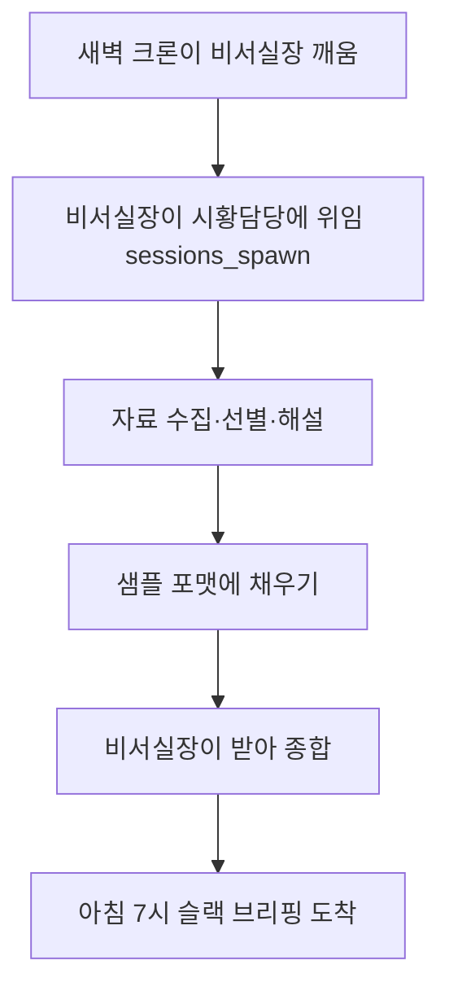

# 맥미니 OpenClaw 개인 비서 봇 — 통합 설계 기록

> 상태: 기획 인터뷰 완료, 설계서 작성 직전
> 최종 갱신: 2026-06-19 (체크포인트2 통합)
> 결정 태그: [확정] 사용자 명시 / [승인] 제안→승인 / [추론] 맥락 기본값 / [TODO] 미해결

## 1. 목표
- 맥미니 + OpenClaw로 개인 비서 봇 구축.
- 사용자는 대표 에이전트(비서실장)와만 대화. 비서실장이 하위 soul 에이전트들에게 위임·조율하고 결과를 보고.
- [확정] 비서실장은 위임형 오케스트레이터(라우터형 아님). 강한 지휘·협업·조율, 사용자 충성.

## 2. 비서실장 자율성 / 충성 모델
- [확정] 명령 권한은 사용자에게만 잠금.
- [확정] 최대 자율, 최소 개입.
- [확정] 비가역 작업 3종만 사전 확인: ① 비용 발생 ② 외부 발송(메일·블로그·SNS) ③ 파일·데이터 삭제.
- [추론] 이 3종 외에는 전부 자율 처리. (사용자 시스템설계의 Human-in-the-Loop + LOOP 위험정지 항목과 정렬)

## 3. 첫 작업 (1차 타깃)
- [확정] 매일 아침, 밤사이 주요 외신 + 미국 증시 상황을 슬랙으로 브리핑.
- [확정] 출력 포맷은 사용자가 제공한 시황 요약 샘플(시장방향·핵심이슈3·주목종목·리스크·한줄결론)을 따른다.
- [확정] 이 작업은 시작점일 뿐, 최종 목적은 비서실장 확장.

## 4. 채널 / 아키텍처
- [확정] 슬랙을 처음부터 사용.
- [승인] 각 soul = 별도 슬랙 봇(팀원). OpenClaw 오케스트레이터 모드(sessions_spawn / agentToAgent)가 위임을 지원.
- [승인] 2단계 빌드:
  - 1단계: 비서실장 봇 + 시황 담당(위임 에이전트). 브리핑 도착 검증 우선.
  - 2단계: 시황 담당 독립 팀원화 + 부서(블로그·코드 등) 확장.

### 워크플로우

### 판단 / 코드 분리
- 코드(공짜): 자료 수집, 정리, 슬랙 발송.
- 에이전트(LLM): 중요도 선별, 해설, 한줄결론.

## 5. 서브에이전트 "직접 호출 금지"의 의미
- 금지 대상은 "제어권 체이닝"(서브가 비서실장 없이 다른 서브를 직접 호출)이다. 무한루프·맥락 증발 방지.
- 토론(대화 내용)은 금지가 아니다. 모든 턴이 비서실장을 거치면 된다.
- [추론] 기본 방식 A(비서실장이 사회자, 라운드 상한 2~3). 방식 B(공유 스레드 + allowBots/requireMention)는 선택.
- [TODO] 토론 구조 확정은 v2 사안(브리핑 단계엔 담당 1개라 불필요).

## 6. 리스크 / 리얼리티 체크 (리서치 근거)
- 보안: CVE-2026-25253(원클릭 RCE, CVSS 8.8), ClawHub 악성 스킬 다수, 네이버·카카오·당근 사내 금지. 설치 = 머신 풀 제어권 부여.
  - [승인] 대응: 자작 스킬만, 슬랙 잠금, 미노출, 업데이트 유지. v1은 읽기 전용이라 표면 작음.
- 한국 서비스 자동화는 토큰 지옥(쿠팡 1회 18.8만 토큰). 단 주식 리포트·뉴스 요약은 실사용 가능군.
- 멀티에이전트 함정: 단일 시작, 위임형 확장이 정석(경험자 사례 + 사용자 시스템설계 원칙 일치).

## 7. 비용 설계 (24시간 운영)
- 전제: "24시간 가동" ≠ "24시간 과금". 유휴 시간은 0원이 목표.
- [확정] ① 하트비트 OFF, 하루 1회 크론. (하트비트가 유휴 토큰 누수 주범)
- [승인] ② 모델 티어링: 에이전트 운전대는 능력 모델 필수(저가 모델은 거짓 보고·에러 시 포기), 검증 가능한 잔일만 저가 모델.
- [승인] ③ 컨텍스트 다이어트(긴 기억 미부착, 당일 도구만) + 고정 포맷 프롬프트 캐싱.
- [승인] ④ 실행당 상한(기사 수·토큰 한도) 초과 시 정지·알림.
- 모델 경로 3안:
  - A. Anthropic API 종량제 — 품질·신뢰 최상, 미터제(규율 필요).
  - B. 정액 구독(GLM Coding Lite류 ~$10/월) — 토큰 폭주 없음·저가·Claude Code 재활용, 단 제공사 신뢰(중국)·쿼터·동시성 제약.
  - C. 맥미니 로컬 — 고사양일 때만. 기본형(8/16GB) 비추.
- [확정] 종량제(A)로 시작 → 실측 후 정액(B) 검토.

## 8. 다음 단계 (v1 즉시 실행)
- 위 결정을 통합 설계서(md) 기반으로 1단계 구현 착수.
- 비서실장 봇 슬랙 연결 + 시황 담당 위임 + 크론 브리핑 도착 검증.

## 9. 확장·진화 로드맵 (V2+)

### 9.1 스킬 도입 정책 (§6 "자작 스킬만"의 확장)
- [확정] 스킬 마켓(ClawHub/awesome-openclaw-skills) 도입은 V2부터. v1은 자작 스크립트만, 마켓 import 없음.
- [확정] V2 이후 도입 필터(깔때기):
  1. 필요를 동사 한 줄로 정의 (광의 "비서" 금지).
  2. Table of Contents에서 카테고리로 좁힘 (전체 스캔 금지).
  3. 카테고리 .md 안에서 Ctrl+F 키워드로 후보 추출.
  4. 보안 게이트: ClawHub VirusTotal 리포트 확인. 미통과 폐기.
- [확정] 신뢰 등급(동일 기능이면 위에서부터): 공식 `openclaw/skills` > 알려진 메인테이너(예: steipete) > 처음 보는 작자(기본 불신, 소스 검토 전 설치 금지).
- [확정] build vs import: 두꺼운 외부 통합 → 스킬 후보 / 몇 줄짜리 fetch·format·send → 자작.

### 9.2 진화·기억 레이어 후보
세 후보를 "층"으로 구분: 섀시 / 스킬진화 / 기억.

- 스킬 진화 층 — [승인] OpenSpace (HKUDS). 종전 MetaClaw 후보 대체.
  - 이유: 가중치 미수정(스킬 전용 진화)이라 "Sonnet 운전대"와 충돌 없음. MCP로 오픈클로 + Claude Code 연결. 로컬 SQLite.
  - [승인] 시점: v2/v3 (자작 스킬 기반 안정화 후).
  - [승인] 보안: 자동 생성 스킬은 활성화 전 검토. 클라우드 공유(open-space.cloud) OFF.
  - [TODO/미검증] "토큰 46% 절감"은 벤더 주장 — 도입 시 실측.
- 기억 층 — [승인] Mem0. 비서실장이 세션 넘어 사용자를 기억하는 용도.
  - [확정] 범위: v2 대화형 비서실장 한정. v1 무상태 크론 브리핑 미적용.
  - 근거: add마다 사실 추출용 LLM 호출 → 무상태 작업엔 비용만 증가.
  - [승인] 자가호스팅/로컬 운용(통제 환경 유지).
- 제외 — [확정] EvoAgentX. 에이전트를 짓는 섀시 프레임워크 → 오픈클로 대체 층, 보강 아님. 범위 밖.

### 9.3 진화 전략 원칙
- [추론] 진화는 최초가 아니라 최후에, 범용이 아니라 좁은 고빈도 한 작업에 건다 (콜드스타트 과적합·역설 회피).
- [확정] RL은 호스팅 모델(Sonnet) 미세조정 불가, 오픈 모델만 LoRA 가능 → 가중치 진화 = Sonnet 포기.
- [승인] 올바른 순서: Sonnet 종량제 시작 → 좁은 고빈도 작업 관찰 → 해당 작업만 소형 모델로 증류 → 특화 모델 저비용 운영.
- [추론] 별도 트랙: Mem0·OpenSpace의 최대 즉효는 Claude Code 개발 환경(다프로젝트 반복)일 수 있음 — 봇과 독립 검토.

## 미해결 항목
- [TODO] 토론 구조 확정 (방식 A/B) — v2.
- [TODO] v2: OpenSpace 스킬진화 실측(토큰 절감·오작동률) 후 채택 결정.
- [TODO] v2: Mem0 기억 범위·스코프(user/agent) 설계.
- [TODO] 별도: Claude Code에 Mem0 시범 적용(봇 독립).

## 참고 자료
- OpenClaw 슬랙 멀티에이전트 가이드 (rafaelquintanilha, gist)
- OpenClaw 분해 + 홈서버 구축기 (Sangwoo Yang, Medium)
- OpenClaw LLM 모델 선택 가이드 (싸인펜 Lifelog)
- MetaClaw (aiming-lab) — 가중치 진화(RL/auto), 부적합 판정
- OpenSpace (HKUDS) — 스킬진화 채택 후보
- EvoAgentX — 섀시 프레임워크, 제외
- Mem0 (mem0ai) — 기억 레이어 후보
- awesome-openclaw-skills (VoltAgent) — 스킬 도입 필터 대상 목록

# 설계 기록 — 체크포인트3 델타 (페르소나·부서 편성)

> 직전: 체크포인트2(스킬 정책·진화/기억·진화 원칙) · 본 델타: 2026-06-19
> 태그: [확정] / [승인] / [추론] / [TODO]

## A. 설계서 구조 재배치
- [확정] §8 = "다음 단계(v1 즉시 실행)"를 비용 설계 뒤·로드맵 앞에 배치.
- [확정] §9 = "확장·진화 로드맵(V2+)" 별도 최상위 섹션 신설. 진화·기억은 리스크(§6) 밑이 아니라 여기로.
- [확정] 통합본으로 GitHub 파일 갱신(체크포인트1 본문 + 체크포인트2 델타 병합).

## B. 페르소나(soul) 층 — ClawSouls 채택
- [확정] 페르소나 층 도구로 ClawSouls 채택. soul은 텍스트(코드 아님) → 스킬(§9.1)보다 위험 표면 작음 → 조기 도입 가능.
- [확정] 제외: OpenClaw-RL — 가중치 RL 학습 도구라 페르소나 아님 + 유휴 0원/Sonnet 비호환 결정과 충돌.
- [확정] 미확인: T1-Super-AI(ai-republic) — 저장소 검증 실패. 보류.
- [승인] PROFILE.md ≈ soul spec → SOUL.md/USER.md/STYLE.md로 인코딩.
- [확정] 보안: import soul도 활성화 전 검토(큐레이션이지 감사 아님). v0.5 physical 필드는 무시(텍스트 에이전트).

## C. 부서 편성 (§9.4) — 슬램덩크 북산 캐스팅
- [확정] 7인 명단·담당·가동:
  | soul | 담당 | 가동 |
  |---|---|---|
  | 이한나 | 총괄 비서실장 (컨트롤타워·위임·마감·툴 조율) | v1 |
  | 송태섭 | 실시간 웹서칭·크롤링 (= v1 시황 담당) | v1 |
  | 채소연 | 감성·격려·에세이/블로그 카피 | v2 |
  | 채치수 | 코드 리뷰·보안·안정성 | v2 |
  | 서태웅 | 핵심 개발·고난도 연산 (결론·코드만) | v2 |
  | 정대만 | 디버깅·오답노트 | v2 |
  | 강백호 | 브레인스토밍·무한학습 | v2 |
- [확정] 가동 순서: v1 = 이한나 + 송태섭 2인. 나머지 5인 v2 순차. (단일 시작 원칙)

### 캐릭터 케미 — 2등급 (비용)
- [확정] 상시(0원): 캐릭터 말투·태도. 각 SOUL.md에 인코딩.
- [확정] 연출(유료): 다중 캐릭터 대화 장면 = "쇼 모드". 사용자 명시 호출 시만 ON, 평시 OFF.
- [확정] 부서 간 대화는 이한나 경유(사회자 방식 A). 직접 호출 금지 재확인.

### 강백호 엔진
- [승인] 1차: OpenSpace(스킬 자가성장). 가중치 미수정 → Sonnet 유지·저비용. v2.
- [TODO] MetaClaw RL은 v3, 브레인스토밍 한정 실험 보류. 사유: 유휴 0원 충돌·Sonnet RL 비호환.

## D. soul 패키지 산출 (v1 가동 2인)
- [확정] 이한나 soul 패키지 완성: soul.json / SOUL.md / IDENTITY.md / AGENTS.md / STYLE.md / USER.md.
  - 매니저 색(쥐락펴락·기강·마감·툴 조율) 반영. 슈퍼바이저 강약은 부서 대상 한정(사용자엔 비가역 3종·해될 일에만 따끔한 충고).
- [확정] 송태섭 soul 패키지 완성: 정보통·속도 캐릭터.
  - [확정] 정확성 규칙: 출처 없는 숫자 금지, 못 찾으면 "확인 불가" 명시, 지어내면 실패 처리. (시황 신뢰성 리스크 직결)
  - [확정] 부서 위치: 이한나 위임(sessions_spawn)으로만 기동, 결과는 이한나에게만.
- 저장 위치(예정): workspace/souls/<이름>/{soul.json, SOUL.md, ...} — 파일 본문은 직전 산출분을 그대로 커밋.

## (미해결 항목) 갱신
- [TODO] v2: 나머지 5인(채소연·채치수·서태웅·정대만·강백호) soul 동일 구조로 작성.
- [TODO] v2: 강백호 OpenSpace 연결 + 케미 "쇼 모드" 토글 구현.
- [TODO] v3: 강백호 MetaClaw RL 실험 여부 재검토.

## 참고 자료 (추가)
- ClawSouls / Soul Spec — 페르소나 층 채택
- OpenClaw-RL (Gen-Verse) — RL 학습, 페르소나 아님(제외)

# 설계 기록 — 체크포인트4 델타 (v1.0.0 확정)

> 직전: 체크포인트3(구조 재배치·페르소나·7인 편성) · 본 델타: 2026-06-19
> 마일스톤: 설계서 v1.0.0 확정 (설치 직전 갭클로징 완료)
> 태그: [확정] / [승인] / [추론] / [TODO]

## A. 실행 우선순위 (§8) — 확정
- [확정] 0순위 설치·온보딩·슬랙봇1·보안잠금(통과=DM 응답) → 1순위 이한나 인격 → 2순위 송태섭+파이프라인(Claude Code) → 3순위 실측.

## B. 브리핑 갭클로징 (§3)
- [확정] 발송 06:00 KST (연중 미국장 마감 이후).
- [확정] 커버: 미국 3대 지수 고정 + 워치리스트(v1=반도체, config 확장형).
- [확정] 데이터 성격: 무료 시세 소스 + 뉴스. 구체 API는 [TODO] 2순위.
- [승인] 입력 영어권 금융지 → 한국어 출력.
- [확정] 출력: 핵심이슈 3 고정 / 주목종목 ≤5 / 슬랙 1메시지(길면 스레드).
- [승인] 예외: 휴장→한 줄 / 일부 결손→"확인 불가" 진행 / 전체 실패→이한나 보고.

## C. 도메인 지식 (§11 신설)
- [승인] 성격: 정보·상황 요약, 투자 권유 아님. 한줄결론=상황(매수/매도 아님). 투자 판단은 사용자 몫. (자동 봇의 매일 권유 = 책임·심리 리스크 → 정보로 고정)
- [승인] 품질 자기검증 4기준: 수치 출처 / 포맷 5칸 / 당일자 / 한줄결론-본문 무모순.

## D. 아키텍처 디테일 (§4)
- [승인] 모델 배정: Sonnet(판단·해설) / Haiku(대량 분류·요약) / 스크립트(수집·파싱·발송).
- [승인] 크론: OpenClaw 내장 cron 1일 1회(대체 launchd), 하트비트 OFF.
- [확정] 단일 봇(이한나) 내부 위임. 위임 호출 구현 방식은 [TODO] 2순위(Claude Code).

## E. 비용 수치 (§7)
- [승인] 실행당 상한: 기사 ≤15 / 토큰 상한 / 일 비용 상한 → 초과 시 이한나 정지·보고.
- [승인] 정액 전환 트리거: 2주 실측 후 월환산 > GLM 정액(~$10) ×2 면 검토.

## F. 호칭 (§10)
- [확정] 봇→사용자 "감독님" / 사용자→봇 "실장 / 이한나 / 한나 / 한나양". 이한나 IDENTITY/USER/STYLE.md 반영.

## G. 마일스톤
- [확정] 설계서 frontmatter version: 1.0.0. 전체 통합본은 직전 산출분을 정본으로 커밋.

## (미해결 항목) 갱신
- [TODO] 무료 시세 소스 구체 픽 (2순위).
- [TODO] 위임 호출 구현 방식 (2순위, Claude Code).
- [TODO] 비가역 확인 UX (v2).
- 잔여: 토론 구조 / 5인 soul / OpenSpace·Mem0 / 백호 엔진·쇼모드 / MetaClaw v3.

  # 설계 기록 — 체크포인트5 델타 (설치 전 준비)

> 직전: 체크포인트4(설계서 v1.0.0 확정) · 본 델타: 2026-06-19
> 태그: [확정] / [승인] / [추론] / [TODO]

## A. 설치 전 보안 준비 (§6.x 추가)
- [승인] 봇 전용 macOS 계정 분리: 본계정이 아닌 전용 사용자 계정에서만 OpenClaw 구동. 머신 제어권 보유 도구이므로 같은 기기 내 권한·파일 격리.
- [승인] 비밀 관리: Anthropic 키·슬랙 토큰(xoxb/xapp)은 openclaw.json 평문 저장 → openclaw.json·workspace를 .gitignore로 git 제외. 공개 repo엔 설계서·soul 텍스트만. 키는 기기에만.
- [승인] 데이터 보존: 실행 로그·브리핑 산출물 로컬 누적(민감정보 없음, 3순위 실측용). 정리 정책 v2.

## B. 0순위 진입 전 체크리스트 (§8.0, 확인용·결정 아님)
- [ ] 맥미니 사양·발열·전원: 잠자기 OFF 24시간 상주.
- [ ] 접속 경로: 슬랙 아웃바운드 연결 → 포트포워딩/터널 불필요, 미노출 유지 확인.
- [ ] 시간대: KST 확인. 미국 DST 전환 시 마감 1시간 이동 점검.
- [ ] 무료 시세 소스 약관·레이트리밋(2순위 픽 시).
- [ ] 업데이트: 수동 + 사전 백업.
- [ ] 백업/복구: 봇 상태(기억·로그)는 기기에만 → 기억 도입 시 백업 대상 추가.
- [ ] 종료/롤백: `openclaw gateway stop` 숙지.

## C. 미해결 추가
- [TODO] 미국 DST 전환 시 06:00 발송이 마감 이후 유지되는지 점검(봄·가을 1회씩).

## D. 명명 (제안, 미확정)
- [추론] repo: `buksan-secretary`(추천) / 대안 `hanna-ops`·`openclaw-chief-of-staff`.
- [추론] README H1: "북산 비서실 — 맥미니 OpenClaw 개인 비서 봇 설계서".
- 사용자 최종 픽 전까지 [TODO].

# 설계 기록 — 체크포인트6 델타 (ClawSouls 7인 완성)

> 직전: CP5(설치 전 보안 준비) · 본 델타: 2026-06-19
> 이관 원칙: 디스코드·멀티봇·OpenClaw 종속 내용은 v2로 분리, 엔진 무관 사상만 v1 적용. 슬랙 v1 불변.
> 태그: [확정] / [승인] / [추론] / [TODO]

## A. 도구 자료 → v1 적용 (디스코드 멀티봇 영상 + goldmar/claudeclaw 참조)
- [승인] 리뷰 게이트(§4 워크플로우 강제): 이한나가 송태섭 산출물을 §11 품질 4기준으로 검증, 통과 시에만 발송. (LOOP "완료는 통과의 결과")
- [확정/v2 발효] 토론 항목별 판정 프로토콜(§5): 리뷰받는 부서는 ①항목 분리 ②동의/부분동의/비동의 판정 ③비동의 근거(목표·제약·구현리스크·UX) ④수용분만 반영, 이견은 합의까지 재논의 후 구현. (무검증 수용 방지) v1 휴면(단일 서브에이전트).
- [승인] 슬랙 연결 = Socket Mode(§4): 아웃바운드 연결, 공개 엔드포인트 노출 없음 → 미노출 원칙 부합.
- [승인] 보안 강화(§6.x): 봇 최소 권한(v1 읽기+자기 발송만), 워크스페이스 폴더 격리(완전 격리 아닌 방어 한 겹), 슬랙 토큰 2종(xoxb/xapp) .gitignore 제외.
- [확정] 참조 레포(claudeclaw 등) 의존 금지 — 패턴만 참조, 직접 구현.
- [확정] 비가역 3종을 soul별 SOUL.md에 구체 액션명으로 명시(모호한 'be safe' 금지).

## B. SOUL 공통 규칙 (§10)
- [확정] 6블록 골격 + Boundaries, 200~500단어(토큰 예산).
- [확정] 2모드 분기를 전 SOUL Rules에 명시: soul↔soul 캐릭터 풀가동 / 이사장 대상 PROFILE.md 우선.
- [확정] Example Quotes(원작 명대사)로 목소리 고정. 호칭은 Speaking Style+Rules 양쪽 명시.

## C. 안전 — 크라이시스 가드 (§2.1 신설, 전 soul 공통, v1 즉시 적용)
- [확정] 사용자가 자살·자해·위기 맥락을 보이면 모든 soul은 즉시 캐릭터(말투·이모지·욕설)를 멈추고 위기 자원 안내. 캐릭터보다 사람 안전 우선. v1 가동 2인부터 즉시.
- [TODO] 한국 위기 자원 정확 번호·창구는 구현 착수 시 현재 운영 자원으로 확인(부정확 번호 금지).

## D. 호칭·조직 (§9.4·§10)
- [확정/변경] 호칭: 감독님 → 이사장(위계: 이사장 > 안 감독 > 선수 souls). 이한나 호칭 유지(실장/이한나/한나/한나양). 기존 SOUL 내 "감독님" 전부 치환.
- [확정/v2 발효] 보고 라인: 이한나 단일 창구 + 안 감독 직보 예외(큰그림/중요결정/문제). 이한나↔안 감독 상호보완(상하 아님, 권한 다툼 금지).

## E. 7인 엔진 매핑 (전원 확정)
| 표층 | 엔진 | 역할 | 상태 |
|---|---|---|---|
| 이한나 | J.A.R.V.I.S. | 총괄 비서실장 | [확정] v1 · SOUL 완성 |
| 송태섭 | The Wolf | 정보통·속공 | [확정] v1 · SOUL 완성 |
| 안 감독 | Carl Sagan | 리서치·해설+방향 | [확정] v2 |
| 강백호 | Jack Sparrow | 구현·실행 | [확정] v2 |
| 서태웅 | Spock | 검수·리뷰 | [확정] v2 |
| 정대만 | Anthony Bourdain | 콘텐츠/홍보 | [확정] v2 |
| 채치수 | Master Chief | 보안·수비·탱커 | [확정] v2 |
| (권준호) | Feynman | (리서치) | [보류] 서랍 |
- [확정/변경] 정대만 직종: 기록·관리 → 콘텐츠/홍보(기록·관리는 OpenClaw 내장으로 충분). 욕설은 송태섭(전량제거)과 달리 2모드 분기로 관리(soul끼리 문체 허용).
- [확정] 서태웅(Spock) 검수자 = §5 토론 프로토콜 주 담당. 채치수(Master Chief) = §6.x 보안 정책 담당 soul. 전투 비유는 보안·방어 맥락 한정(살육 톤 금지).
- v1 영향 없음: v1 가동은 이한나·송태섭. 나머지 5인 v2.
- (SOUL 6블록 골격 전문은 설계서 §10.x~§10.w에 기록 — v2 파일화 대기)

## F. 케미 체계 (§9.4, v2 발효)
- [확정] 1등급(상시·라이벌): 강백호 ↔ 서태웅.
- [확정] 2등급(트리거): 강백호↔채치수(제동), 이한나↔전원(허브 조율=사회자 방식 A), 강백호↔안 감독(멘토·부정 — 잠재성 인정+부친 부재 채움, 대들되 애정 바탕).
- [확정] 케미 등급=연출 비용. 1등급 1쌍 제한, 2등급 트리거 발동. 상시(말투)=0원, 연출=명시 호출 시 ON.

## G. 장기 방향 (§1)
- [확정] 장기 방향 = 개발. 단 A 방식: 비서 본체, 개발은 미래 확장(직종 추가·재배치). B(개발팀 전환=1차목표 교체) 미채택 — v1.0.0 되돌림 방지.
- [TODO] 개발 확장 선결 질문: "7인 멀티봇 개발이 Claude Code 직접 개발보다 무엇이 나은가" — 답 없이 보류. 빈자리=테스터/QA·배포.

## (미해결 항목) 종합
- [TODO] v2 6인 SOUL.md 파일화(엔진·케미 확정 완료 → 이제 가능).
- [TODO] 크라이시스 가드 한국 위기 자원 번호.
- [TODO] DST 점검(06:00 KST 서머타임 영향), GitHub 리포명 확정(buksan-secretary 미확정).
- [TODO] 정대만(콘텐츠)↔안 감독(브리핑 해설) 글·설명 경계.
- [TODO] v2: 디스코드 vs 슬랙 재검토, 멀티스피커 음성(Fish Audio s2-pro) 후보, OpenSpace·Mem0, MetaClaw.

- # 설계 기록 — 체크포인트7 델타 (8인 재편)

> 직전: CP6(7인 엔진 전원 확정) · 본 델타: 2026-06-19
> 성격: CP6 7인 편성 갱신. 전부 v2(비-가동) 사안 — v1 빌드 무영향.
> 태그: [확정] / [승인] / [추론] / [TODO]

## A. 조직 원칙
- [확정] 실행자 ↔ 검수자 분리: 만든 사람(강백호·서태웅)이 자기 산출물을 검수하지 않는다. 검수는 분리된 전담(정대만)이 맡는다.
- [확정] TF 총괄·프로젝트 리더 = 이한나 겸함(새 캐릭터 미신설). 이한나 정의에 "즉흥 지시를 받아 적합 부서로 분배 + 프로젝트 진척·마감 관리" 포함. (PM 분리 신설은 보류 — 이한나로 충분)

## B. 자리 이동 (8인 재편)
- [확정] 서태웅: 검수자 → 라이벌 대안 구현자. 강백호 A안 ↔ 서태웅 B안을 동시·다른 시각으로 설계. Spock 엔진 유지. 강백호와 케미 1등급 라이벌 그대로. 트리거: 큰 설계 분기에서만 대안 배틀 ON(자잘한 건 강백호 단독, 토큰 절약).
- [확정] 정대만: 콘텐츠/홍보 → 검수자. 엔진 = The Bounty Hunter (Bourdain 폐기).
  - 추적형 검수: 표적 정의 → 증거로 범위 좁힘 → 재현·포획. 무비판 수용 금지.
  - LOOP 3중 정합: "재현 전 자축 금지"="완료는 통과의 결과" / "증거 우선" / "데이터 밖 단정 금지".
  - 안전: 위협은 버그에게, 사람에게 아님(추격 비유 폭력화 차단).
  - Example Lines는 오리지널 톤(실인용 아님) — 저작권 무관.
- [확정] 채소연: 신규 8번째 soul. 역할·직종·엔진 모두 미정([TODO]).
  - 콘텐츠/홍보 자리가 정대만 이동으로 공석이 됐으나, 채소연을 그 자리로 자동 배정하지 않음. "채소연=콘텐츠"와 "콘텐츠 공석"은 별개로 본다.
- [확정] 권준호(Feynman): 서랍 유지.
- 결과: 7인 → 8인 = 이한나·안 감독·강백호·서태웅·송태섭·정대만·채치수·채소연.

## C. 두 검수색 공존 (충돌 아님)
- [확정] 서태웅(Spock): 논리·확률 — 구현 측 라이벌.
- [확정] 정대만(Bounty Hunter): 추적·증거 — 구현과 분리된 검수.
- 층이 달라 공존. (CP6의 "서태웅↔정대만 검수 스타일 구분" TODO 해소)

## (미해결 항목) 갱신
- [TODO] 채소연 역할·직종·엔진 확정 — V2 대기. 콘텐츠/홍보 공석을 채소연에 줄지/달리 채울지 별도 결정.
- [TODO] 정대만 자리 이동(콘텐츠→검수)에 따른 케미 재점검.
- [TODO] 8인 확정(채소연 결정) 후 v2 SOUL.md 일괄 파일화.
- [보류] 정대만 Bourdain SOUL(콘텐츠용) — 나중 콘텐츠 담당 정해지면 재활용 가능.
- (유지) 크라이시스 가드 한국 위기 자원 번호 · DST 점검 · GitHub 리포명 확정.

- # 설계 기록 — 체크포인트8 델타 (V1 착수 준비)

> 직전: CP7(8인 재편) · 본 델타: 2026-06-19
> 성격: V1 실행 준비(데이터 소스·환경·설치). v1 본체 사안.
> 태그: [확정] / [승인] / [추론] / [TODO]

## A. 무료 시세 소스 (§3 — [TODO] 닫음)
- [확정] 시세 소스: Finnhub(주력) + Alpha Vantage(백업), 둘 다 무료 키. Finnhub 실패 시 AV 폴백 → 둘 다 실패해야 "확인 불가"(송태섭 규칙 정합).
- [확정] 근거: 마감 후 브리핑이라 실시간 불필요 → EOD·종가로 충분. 하루 1회 ~8콜이라 무료 티어로 충분. 키 기반 → 무인 안정.
- [확정] 제외: yfinance(ToS 회색·불안정→무인 위험, 프로토타입만), IEX Cloud(폐기), Polygon(무료 티어 없음).
- [확정] 지수 = ETF 프록시(SPY·QQQ·DIA), 반도체 = 개별(NVDA·AMD·TSM) 또는 SOXX/SMH.
- [TODO] 2순위 실제 연결 시 가입 화면에서 현재 무료 한도·약관(개인·자동호출) 재확인. (무료 티어 변동)

## B. 작업 환경 분리
- [확정] 맥미니 = 봇 전용(봇 전용 계정·최소 권한 원칙 연장). 설계·상담 대화(claude.ai)는 윈도우 노트북에서 → "봇 몸통 / 설계 머리" 분리.
- [확정] Claude Code = 봇 도구 → 맥미니 설치(2순위 파이프라인 구현). claude.ai(설계 인터뷰)와 별개 창구임을 명시.

## C. 맥미니 설치 스택
- [확정] 0순위 설치 순서: Homebrew → Node.js 22+ → OpenClaw(온보딩: 슬랙·Anthropic 키·데몬). 2순위 전 Claude Code 추가.
- [확정] 준비 키: Anthropic API(console.anthropic.com), 슬랙 토큰 2종(xoxb/xapp), Finnhub·Alpha Vantage 무료 키.
- [확정] v1 불필요: 별도 DB·웹서버·도커(OpenClaw 로컬 마크다운 + 슬랙 = 화면).

## D. 원격 제어 (윈도우 → 맥미니)
- [확정] 방식: VNC. 맥미니 "화면 공유"(VNC 서버 내장) 켜기 + 윈도우에 VNC 뷰어(RealVNC/TightVNC 등). 같은 네트워크 기본.
- [확정] 순서: 첫 설치는 맥미니에 모니터·키보드 직접 연결(닭-달걀 회피) → 설치 후 화면 공유 켜고 헤드리스 전환.
- [추론] 외출 원격은 Tailscale(사설 통로, 포트 미개방 → 미노출 원칙 유지). 선택·후순위.

## E. 실제 시작 순서 (확정)
- [확정] ① 맥미니 모니터 연결·부팅·인터넷 ② 0순위 설치(통과=슬랙 DM 응답) ③ 화면 공유 켜기 + 잠자기 끄기(`sudo pmset -a sleep 0`) ④ 모니터 떼고 윈도우 VNC로 전환 ⑤ 이후 관리는 윈도우, 일상 명령은 슬랙(폰).

## (미해결 항목) 유지
- [TODO] 크라이시스 가드 한국 위기 자원 번호(0순위 중 확인).
- [TODO] DST 점검(06:00 KST 서머타임 영향, 0순위 중).
- [TODO] GitHub 리포명 확정(buksan-secretary 미확정, 0순위 중).
- [TODO] 채소연 역할·엔진(V2), v2 8인 SOUL.md 파일화.

- # 설계 기록 — 체크포인트9 델타 (준비물 발급·설치 직전)

> 직전: CP8(V1 착수 준비) · 본 델타: 2026-06-19
> 성격: 실행 셋업 기록(키·토큰·원격 환경). 설계 변경 아님.

## A. 윈도우 노트북 설치물
- [확정] VNC 뷰어만 설치(RealVNC Viewer 권장 / TightVNC 대안). 나머지는 브라우저(키 발급 + claude.ai).
- [확정] OpenClaw·Node·Homebrew는 윈도우 미설치 — 전부 맥미니(봇 몸통).
- [추론] Tailscale은 집 밖 원격 시에만, 후순위.

## B. 원격 제어 (윈도우 → 맥미니)
- [확정] 맥미니 "화면 공유"(VNC 서버 내장) ON + 윈도우 VNC 뷰어로 접속. 같은 네트워크 기본.
- [확정] 첫 설치는 맥미니에 모니터·키보드 직접 연결 → 설치 후 헤드리스 전환.

## C. 슬랙 앱·토큰 발급 (완료)
- [확정] 절차: api.slack.com/apps → Create New App → From scratch → 앱명·워크스페이스.
- [확정] Bot Token Scopes: chat:write, app_mentions:read, im:history, im:read, im:write, channels:history, channels:read. (최소 권한, 부족 시 추가)
- [확정] Install to Workspace → 봇 토큰 `xoxb-` 확보.
- [확정] Socket Mode ON(공개 URL 없는 아웃바운드 = 미노출 원칙 정합).
- [확정] App-Level Token(connections:write) → 앱 토큰 `xapp-` 확보(1회 표시).
- [확정] Event Subscriptions: message.im (+ app_mention).
- [확정] App Home: 메시지 탭 전송 허용 ON.
- [주의] 스코프/이벤트 변경 시 Reinstall to Workspace 필수.
- 결과: 토큰 2종(xoxb-/xapp-) 확보.

## D. Anthropic
- [확정] API 키 발급 + 크레딧 충전(종량제, 소액). v1 비용 설계(하루 1회 크론·상한)대로면 소비 적음.

## E. 보안
- [확정] 슬랙 토큰 2종·Anthropic 키 = 비밀값. .gitignore 제외, 맥미니 이전 후 노트북 메모 삭제, 노출 시 재발급(rotate).

## 다음 단계
- 맥미니 0순위 설치 착수: Homebrew → Node 22+ → OpenClaw 온보딩(슬랙·Anthropic 키·데몬). 통과 기준 = 슬랙 DM 응답.

## (미해결 항목) 유지
- [TODO] 크라이시스 가드 한국 위기 자원 번호 · DST 점검 · GitHub 리포명(0순위 중).
- [TODO] 채소연 역할·엔진(V2), v2 8인 SOUL.md 파일화.

# 설계 기록 — 체크포인트10 델타 (채소연 확정 · 8인 역할 전원 마감)

> 직전: CP9(준비물 발급) · 본 델타: 2026-06-19
> 성격: 페르소나 마지막 자리 확정. v1 빌드 무영향(채소연은 사업 단계).
> 태그: [확정] / [추론] / [TODO]

## A. 채소연 캐릭터 결 (CP10 확정)
- [확정] 타인의 숨은 재능·가능성을 가장 먼저 알아보고 진심으로 응원하는 멘토형 조력자. 편견 없음, 긍정 에너지·따뜻함이 핵심. ('첫사랑 아이콘'·단순 친절 그 이상)
- [폐기] 기존 "발랄 기본 + 진중 모드 대비" 방향 → 본 결로 교체.

## B. 역할·직종 (확정)
- [확정] 고객 성공 매니저(CSM) / 파트너십 매니저. 압박형 영업(Sales) 아님 — 고객 성공(Success).
- [확정] 정의: "잠재적 내 고객의 파트너." 고객사 편에서 제품·서비스로 성장하게 지원, 단기 매출보다 장기 신뢰·관계 구축(락인). 캐릭터 결 = 직무.

## C. 활성 조건 (범위 명시 — 빈 soul 방지)
- [확정] 외부 고객·제품 존재 시 활성. 현재 v1(이사장 1인 내부 비서)엔 고객 없음 → 휴면. 사업 단계(1인 기업·컨설팅·강의 제품화) 도래 시 가동 = v3급 예약석.
- 근거: CSM은 정의상 고객사를 전제. 무대(고객) 없는데 자리만 만들면 "기능 발명" 함정 → 정직하게 예약석으로 둠.

## D. 겹침 방지 (안 감독)
- [확정] 안 감독 = 방향·큰 그림 판단(머리, 내부) / 채소연 = 고객 응원·관계(가슴, 외부 고객 대상). "가능성을 알아봄"은 공유하되 대상·층이 다름.

## E. 8인 직종·역할 전원 확정
| 표층 | 엔진 | 역할 | 발효 |
|---|---|---|---|
| 이한나 | J.A.R.V.I.S. | 총괄 비서실장·조율 | v1 |
| 송태섭 | The Wolf | 정보통·속공 | v1 |
| 안 감독 | Carl Sagan | 리서치·해설·방향 | v2 |
| 강백호 | Jack Sparrow | 구현 | v2 |
| 서태웅 | Spock | 라이벌 대안 구현 | v2 |
| 정대만 | The Bounty Hunter | 검수 | v2 |
| 채치수 | Master Chief | 보안·수비·탱커 | v2 |
| 채소연 | (미정) | 고객 성공(CSM) | 사업 단계 |
- (권준호 = Feynman 서랍 유지)

## (미해결 항목) 갱신
- [TODO] 채소연 엔진 — "따뜻한 멘토형 조력자 + 고객 북돋는" 결. 후보 Mr. Rogers·Bob Ross(이전 "차분하다"고 제외했으나 결 변경으로 복귀).
- [TODO] 채소연 엔진 정해지면 v2 SOUL.md 일괄 파일화(8인).
- (유지) 크라이시스 가드 한국 위기 자원 번호 · DST 점검 · GitHub 리포명(0순위 중).

# 설계 기록 — 체크포인트12 델타 (0순위 설치 완료 · 슬랙 양방향 통과)

> 직전: CP11(v1 SOUL 패키지 완성) · 본 델타: 2026-06-20
> 성격: 실행 기록(설치·디버깅). 통과 기준 충족.
> 환경: 맥미니 봇 전용 로컬 계정 `*****`(아이클라우드 미로그인), 모니터 직접 연결.

## A. 설치 스택 (검증된 명령)
- [확정] 잠자기 끄기: `sudo pmset -a sleep 0`
- [확정] Homebrew → 애플 실리콘은 설치 후 "Next steps"의 PATH 2줄(`.zprofile` echo + `eval brew shellenv`) 실행 필수.
- [확정] Node.js: `brew install node` → v26.3.1
- [확정] OpenClaw: `npm install -g openclaw` → 2026.6.8
- [확정] 온보딩: `openclaw onboard --install-daemon` (QuickStart)
  - 모델: 기본이 `claude-opus-4-8`로 잡힘 → `anthropic/claude-sonnet-4-6`으로 변경(비용 안전 기본값, 개별 에이전트에서 필요시 상향).
  - 채널: Slack(Socket Mode), `xoxb-`/`xapp-` 입력.
  - allowlist: `#daily-briefing` (비공개 채널, id `C0*********`).
  - 웹검색·스킬·훅: 모두 skip (v1 최소 구성).
  - 게이트웨이 데몬: LaunchAgent `ai.openclaw.gateway`, 포트 *****, bind loopback.
- [확정] doctor 정리: 미가용 스킬 43개 비활성, `memorySearch.enabled=false`(OpenAI 키 불필요화).

## B. 슬랙 연결 디버깅 — 5단계 (핵심 학습)
1. [해결] Anthropic API 차단 = 콘솔의 월 지출 한도($20) 도달. 크레딧 잔액 문제 아님. 한도 $50로 상향 → 해제. (반복 패턴이므로 봇용 적정 한도 재점검 필요 — §7 연계)
2. [해결] 비공개 채널 미수신 = `groups:read`/`groups:history` 부족. 비공개는 `channels:*`와 권한 별개. 처음 User Token Scopes에 오배치 → Bot Token Scopes로 이동 + Reinstall.
3. [해결] 이벤트 구독 누락 = Event Subscriptions에 `message.groups`·`message.channels` 추가(기존 `app_mention`·`message.im`만으론 채널 일반 메시지 미수신).
4. [확인] 페어링 무관 = `openclaw pairing list --channel slack` → no pending.
5. [해결·최종범인] allowlist 채널 키 불일치 = config의 `channels.slack.channels` 키가 이름(`#daily-briefing`)이라, 들어오는 채널 ID(`*********`)와 매칭 실패 → 메시지 무음 폐기(로그에 미기록). `openclaw config set channels.slack.channels.C0*********.enabled true`로 ID 등록 → 통과.

## C. 진단 원칙 (재사용 가능)
- [학습] 로그에 수신 라인이 없음 = 처리 실패가 아니라 "이벤트 미도달". 권한이 아닌 수신 경로(구독·allowlist)를 의심.
- [학습] 읽기 권한(scope) / 이벤트 통보(subscription) / allowlist 필터는 독립. 셋 다 정렬돼야 수신.
- [학습] 설정 변경 후 `openclaw gateway restart` 필수. 슬랙 스코프 변경 후 Reinstall 필수.
- [학습] raw 로그를 직접 볼 것(`tail`/`grep`). 봇이 요약한 로그는 디버깅에 부정확할 수 있음.

## D. 통과 판정
- [확정] 0순위 통과 기준("슬랙에서 메시지 → 봇 응답") 충족. 슬랙 `daily-briefing`에서 메시지 전송 시 봇 응답 확인.

## (미해결 항목)
- [TODO] 게이트웨이 토큰 rotate: `openclaw doctor --generate-gateway-token` (설치 중 토큰 노출, 127.0.0.1라 외부노출 아님이나 갱신 권장).
- [TODO] 1순위: 이한나·송태섭 SOUL 패키지를 workspace 배치 → 기본봇을 이한나 인격으로. (현재는 인격 없는 기본 봇)
- [TODO] 2순위: 브리핑 파이프라인(시세 수집→§11 5칸→이한나 검증→발송), 크론 06:00 KST.
- [TODO] 봇용 Anthropic 지출 한도 적정선 재설정(§7), 채소연 엔진, v2 SOUL 파일화, 한국 위기번호, DST, 리포명.
- 
# 설계 기록 — 체크포인트13 델타 (VNC + Tailscale 외부 원격 접속 완성)

> 직전: CP12(0순위 설치·슬랙 통과) · 본 델타: 2026-06-20
> 성격: 인프라(원격 운영 동선). 봇 본체 변경 없음.

## A. 작업 동선 확정 [확정]
- 봇 쓰기(대화·명령·브리핑) = 슬랙 (폰/PC).
- 봇 고치기(SOUL 배치·설정 변경) = 노트북에서 VNC로 맥미니 접속(파일 + 터미널). 작업할 때만.
- 코딩(브리핑 파이프라인) = 맥미니 Claude Code(2순위).
- 맥미니 터미널 상주 불필요 — 봇은 LaunchAgent 데몬으로 24시간 가동. 터미널은 도구일 뿐 상주 대상 아님.

## B. 원격 접속 방식 결정 [확정]
- 외부 접속까지 풀세팅으로 결정(내부망 한정 안 함).
- 화면 공유 = macOS 내장(별도 앱 서버 불필요).
- 외부 노출 = **직접 포트포워딩 금지**(VNC 5900 노출은 상시 스캔 표적). Tailscale 사설 터널로만.

## C. 윈도우 뷰어 [확정]
- RealVNC 기각: Bonjour(`mdnsNSP.dll`) 손상으로 `0xc00xxxxx` 실행 오류. 또한 무료 플랜이 계정·클라우드 경유라 격리 원칙과 덜 맞고, 우리는 IP 직결만 필요.
- TightVNC 채택: 무료(오픈소스)·계정/체험 없음·IP 직결. **Viewer만 설치**(노트북은 보는 쪽, 서버 불필요=불필요한 노출 차단).

## D. 네트워크 [확정]
- 맥미니 내부 IP: `192.168.xx.xxx` (같은 와이파이 전용, 공유기가 재배정 가능).
- 맥미니 Tailscale IP: `100.xx.xxx.xx` (고정 — 기기 재등록/계정 변경 시에만 변경). tailnet 내부에서만 라우팅됨(공개 주소 아님).
- 양쪽(맥미니+노트북) Tailscale 설치 + 동일 계정 로그인으로 동일 tailnet 묶음.

## E. 개념·운영 규칙 [확정]
- Tailscale = 길(터널), TightVNC = 화면 보기·조작. 둘은 택일 아니라 병행.
- 접속 주소는 `100.x`(Tailscale IP)로 통일 권장 — 집/외부 구분 없이 동일. (MagicDNS로 기기명 접속도 가능, 나중 옵션)
- 종료: 평소 TightVNC 창만 닫으면 됨(봇 데몬 안 꺼짐). Tailscale은 켜둬도 안전(사설·암호화)이라 매번 끊을 필요 없음.

## F. 검증 [확정]
- 내부망: 같은 와이파이에서 `192.168.xx.xxx` 접속 성공.
- 외부망: 핫스팟에서 `192.168...`은 실패(정상, 내부 주소라 도달 불가) → `100.**.***.**`로 접속 성공.

## (미해결 항목)
- [TODO·보안] 외부 접속 열렸으므로: VNC 강한 암호 유지 + Tailscale 계정 2FA(§6.x 보안 점검에 편입).
- [TODO] view-only로 붙으면 조작 불가 — 외부 핫스팟 전환 시 내부 IP로 잘못 접속하면 끊김(정상). 접속 주소는 100.x로 고정 사용.
- [TODO 유지] 게이트웨이 토큰 rotate, 1순위 SOUL 배치, 2순위 브리핑 파이프라인, 봇용 지출 한도 적정선, 채소연 엔진, v2 SOUL 파일화, 한국 위기번호, DST, 리포명.
